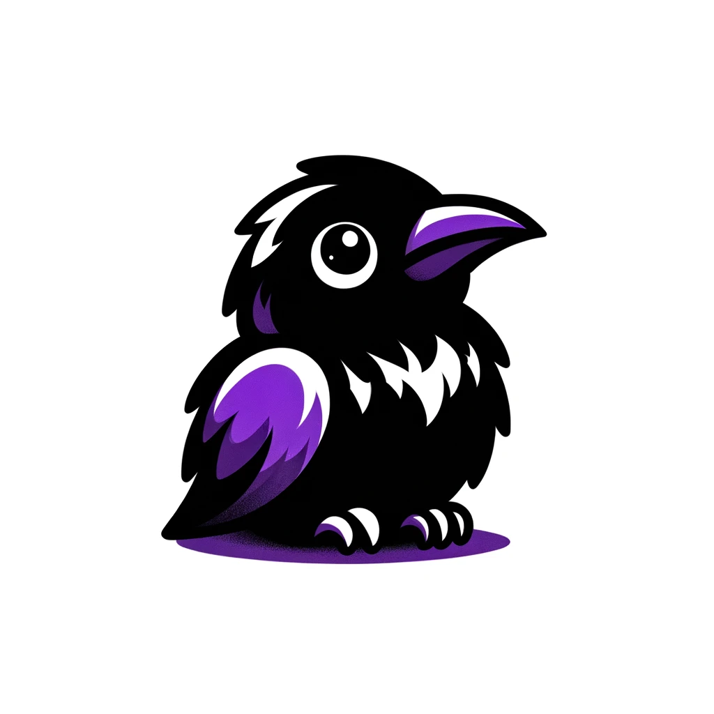

# To Ten Ten

画像をドット絵に変換するアプリケーションです。

[To Ten Ten](https://crow-fox.github.io/to-ten-ten/)

## もとの画像

## 変換後の画像

## 使い方

### 変換したい画像をアップロード

ファイルを選択するボタンをクリックして、変換したい画像を選択します。

### 変換する

ドットのサイズや、ドットの色を選択することで自動的に変換されます。

### もとの画像と比較する

タブを切り替えることで、もとの画像と変換後の画像を比較することができます。

### 画像を保存する

ダウンロードボタンから、変換した画像を保存することができます。

ダウンロードできる画像の形式は下記のリストです。

- png
- jpeg
- webp

### 画像のコードをコピーする

コードボタンから、変換した画像を表示できるコードをクリップボードにコピーすることができます。

コピーできるコードの形式は下記のリストです。

- SVG
- CSS box-shadow

## 開発環境

### 依存関係のインストール

`bun run install`

### 開発サーバーの起動

`bun run dev`

### ビルド

`bun run build`

### 公開

GitHub Pages に公開しています。

Github Actionsを使用して、masterブランチにpushされた際に自動でビルド・デプロイされます。
